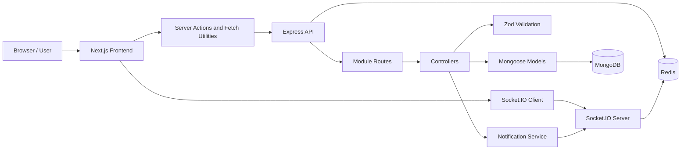
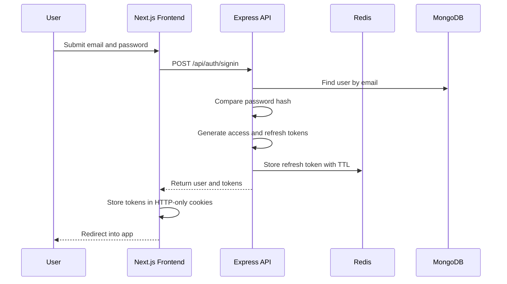
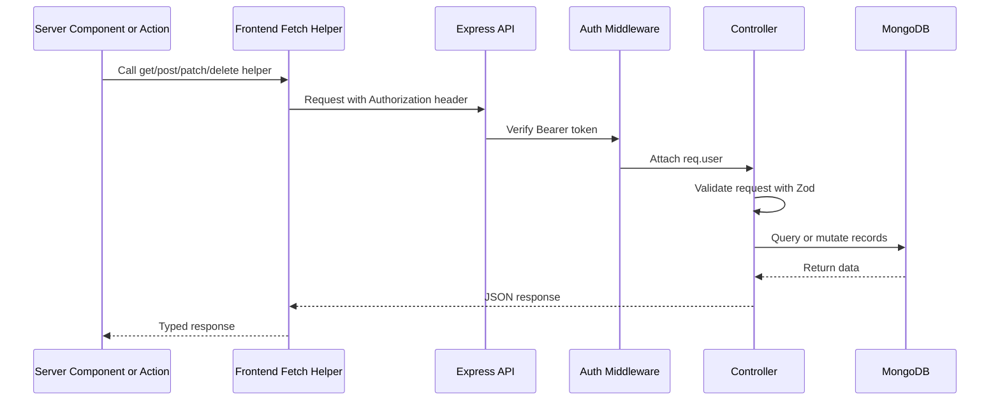

# Hi Devs


Hi Devs is a full-stack developer community platform for learning, collaboration, and career growth. It gives developers a place to ask technical questions, publish engineering blogs, discover jobs, apply to open roles, manage professional profiles, and receive realtime notifications when the community interacts with their content.

This workspace contains both applications used by the platform:

| Application | Local Folder | Repository | Purpose |
| --- | --- | --- | --- |
| Frontend | [`devTalk-fe`](./devTalk-fe) | [github.com/Hasibul-Islam-Shanto/hi-devs-fe](https://github.com/Hasibul-Islam-Shanto/hi-devs-fe) | Next.js app for routes, UI, forms, authentication flow, realtime notifications, and user-facing product experience. |
| Backend | [`devTalk-be`](./devTalk-be) | [github.com/Hasibul-Islam-Shanto/hi-devs-be](https://github.com/Hasibul-Islam-Shanto/hi-devs-be) | Express API for authentication, users, questions, blogs, comments, jobs, applications, notifications, sockets, persistence, and API documentation. |

## Table of Contents

- [Platform Overview](#platform-overview)
- [Repository Links](#repository-links)
- [Core Features](#core-features)
- [How the Product Works](#how-the-product-works)
- [Tech Stack](#tech-stack)
- [Architecture](#architecture)
- [Frontend Architecture](#frontend-architecture)
- [Backend Architecture](#backend-architecture)
- [Request and Auth Flow](#request-and-auth-flow)
- [Domain Model](#domain-model)
- [Project Structure](#project-structure)
- [Getting Started](#getting-started)
- [Environment Variables](#environment-variables)
- [Available Scripts](#available-scripts)
- [API Modules](#api-modules)
- [Realtime Notifications](#realtime-notifications)
- [Common Development Tasks](#common-development-tasks)
- [Testing and Quality](#testing-and-quality)
- [Development Workflow](#development-workflow)
- [Troubleshooting](#troubleshooting)
- [Deployment Notes](#deployment-notes)
- [Contributing](#contributing)

## Platform Overview

Hi Devs is built as two separate TypeScript applications that work together through a clean HTTP and Socket.IO contract.

The frontend is responsible for the product experience. It renders public pages, protected dashboard areas, auth screens, profile management, content creation forms, listings, detail pages, application workflows, and realtime notification surfaces. It uses Next.js App Router, server actions, React Server Components, client components, Zustand stores, Zod schemas, and reusable UI primitives.

The backend owns the business logic and platform data. It exposes REST APIs under `/api`, validates requests with Zod, persists data with MongoDB and Mongoose, manages JWT-based authentication, stores refresh-token state in Redis, powers realtime notifications with Socket.IO, and documents endpoints through Swagger UI.

Together, the apps support a practical developer community workflow: users can join the platform, publish and discover content, interact through likes and comments, post jobs, apply to jobs, review applicants, and receive live updates as activity happens.

The platform is intentionally organized around product domains instead of technical layers alone. Questions, blogs, jobs, applications, comments, users, and notifications each have a clear backend module, matching frontend routes, shared types, validation rules, and UI surfaces. This makes the codebase approachable when a developer needs to add a field, create a new endpoint, adjust a form, or connect a new product workflow across both applications.

## Repository Links

This workspace is one repository. The frontend lives in `devTalk-fe` and the API lives in `devTalk-be`. The GitHub projects below are the original app repositories.

### Frontend Repository

[](https://github.com/Hasibul-Islam-Shanto/hi-devs-fe)

- Repository: [https://github.com/Hasibul-Islam-Shanto/hi-devs-fe](https://github.com/Hasibul-Islam-Shanto/hi-devs-fe)
- Local folder: [`devTalk-fe`](./devTalk-fe)
- Main responsibility: user interface, route rendering, frontend-owned API routes, server actions, form validation, client state, and Socket.IO client integration.

### Backend Repository

[](https://github.com/Hasibul-Islam-Shanto/hi-devs-be)

- Repository: [https://github.com/Hasibul-Islam-Shanto/hi-devs-be](https://github.com/Hasibul-Islam-Shanto/hi-devs-be)
- Local folder: [`devTalk-be`](./devTalk-be)
- Main responsibility: REST API, database models, authentication, authorization, request validation, notification creation, realtime delivery, Swagger documentation, and tests.

## Core Features

### Authentication and Session Management

Users can create accounts, sign in, refresh sessions, and log out. The backend issues access and refresh tokens, validates JWTs, and stores refresh-token state in Redis. The frontend stores tokens in HTTP-only cookies and protects private pages through Next.js proxy middleware.

### Questions and Answers

Developers can ask technical questions with descriptions and tags. Question feeds support discovery and search, while detail pages support likes and comments so the community can discuss solutions.

### Engineering Blogs

Users can publish long-form blog posts with a title, description, cover image, and tags. Blog detail pages render rich Markdown-style content and support community engagement through likes and comments.

### Jobs and Applications

Job posters can create job listings with company, location, employment type, salary range, required skills, and expiry information. Developers can apply with resume links and cover letters. Job owners can view applications and update applicant status.

### User Profiles

Each user has a profile with name, username, avatar, bio, location, website, social links, skills, and recent activity. Profile editing is split into focused frontend sections to keep the flow easier to maintain.

### Comments and Likes

Comments are polymorphic and can belong to questions, blogs, or jobs. Questions, blogs, and comments support likes, enabling lightweight community interaction across the product.

### Realtime Notifications

The backend creates notifications for important activity such as comments, likes, replies, and applications. Socket.IO delivers notifications to authenticated users in realtime, while the frontend stores recent notifications in Zustand for fast UI updates.

### API Documentation

The backend serves Swagger documentation at `/api-docs`, making the API easier to inspect, test, and integrate with during development.

## How the Product Works

Hi Devs is designed around a few connected user journeys. Each journey crosses both repositories, so this section explains the product behavior in a way that makes implementation work easier to trace.

### Visitor Journey

A visitor can browse public content without signing in. Public routes include the home page, question feed, blog feed, job feed, and public detail pages. These pages fetch data from the backend with unauthenticated API calls and render server-side where possible so the first view is fast and indexable.

When a visitor tries to create content, edit a profile, apply for a job, or open protected account areas, the frontend proxy checks authentication state and redirects the user to sign in. The redirect keeps a callback URL so the user can return to the page they originally wanted after authentication.

### Member Journey

After signing in, a member can create questions, publish blogs, post comments, like community content, update their profile, apply for jobs, and receive notifications. Authenticated frontend server actions read the access token from HTTP-only cookies and send it to the backend as a Bearer token. The backend middleware verifies the token and attaches the user identity to the request before controller logic runs.

### Job Poster Journey

A job poster can create a job listing and later review applications for that job. Application listing and application decision routes are intentionally protected so only the job owner can view applicants or update status. This ownership check is enforced on the backend, not only hidden in the UI.

### Notification Journey

When a user interacts with another user's content, the backend creates a notification record and emits a realtime event to the recipient's Socket.IO room. The frontend listens for that event, updates local notification state, and shows the new item without requiring the user to refresh the page.

## Tech Stack

### Frontend

| Area | Technology | Usage |
| --- | --- | --- |
| Framework |  | App Router, layouts, pages, server rendering, proxy middleware, and frontend API routes. |
| UI Runtime |  | Server and client components for forms, layouts, cards, navigation, modals, and realtime surfaces. |
| Language |  | Strong typing for components, server actions, API responses, shared models, and form data. |
| Styling |  | Utility-first styling, design tokens, responsive layouts, and reusable UI primitives. |
| Components |  | Accessible dialogs, dropdowns, selects, labels, tabs, avatars, and other primitives. |
| Forms |   | Performant form state and schema-based validation for auth, posts, jobs, applications, and profiles. |
| State |  | Lightweight client state for auth, shell UI, sockets, and notifications. |
| Realtime |  | Authenticated realtime connection for notification delivery. |
| Icons |  | Consistent icon system for navigation, metadata, buttons, and empty states. |
| Quality |   | Static analysis, formatting, import organization, and code style consistency. |

### Backend

| Area | Technology | Usage |
| --- | --- | --- |
| Runtime |  | JavaScript runtime for the API server and build tooling. |
| Language |  | Strict typing for controllers, models, middleware, services, sockets, and tests. |
| Web Framework |  | REST API routing, middleware composition, request handling, and Swagger mounting. |
| Database |  | Data persistence for users, questions, blogs, comments, jobs, applications, and notifications. |
| Cache and Token State |  | Refresh-token storage, notification unread-count cache, and rate-limit support. |
| Authentication |  | Access and refresh token generation and verification. |
| Realtime |  | Authenticated user rooms and notification event delivery. |
| Validation |  | Request body, params, and query validation before controller logic runs. |
| API Docs |  | Interactive backend API documentation at `/api-docs`. |
| Testing |  | Unit and integration tests with Supertest. |
| Build |  | Fast TypeScript compilation into production JavaScript. |

## Architecture

The platform follows a straightforward separation of concerns:



Frontend requests are built through typed helper functions and server actions. Backend routes validate input with Zod, use authenticated request context when required, query or mutate MongoDB through Mongoose models, and return JSON responses consumed by the frontend.

Socket.IO runs beside the HTTP API. Authenticated users join personal rooms, allowing the notification service to emit events directly to the affected user.

## Frontend Architecture

The frontend repository is a Next.js App Router application. It separates route ownership, reusable UI, server mutations, validation, shared types, and client state so feature work can be added without scattering logic across unrelated folders.

### App Router and Route Groups

Routes live under `devTalk-fe/app`. The app uses route groups to separate authentication screens from the main application experience:

- `app/(auth)` contains sign-in and sign-up pages.
- `app/(main)` contains the authenticated and public product shell, including home, questions, blogs, jobs, applications, notifications, and profile routes.
- `app/api` contains frontend-owned API routes, such as controlled token access for client-side code.

Feature-specific components are usually colocated beside their route in `_components`. For example, job detail sections live under the job route, and notification page components live under the notification route. Shared UI primitives live in `components/ui`, while cross-feature layout and interaction components live under `components`.

### Server Actions

The `actions` directory contains server-side functions for mutations. These actions are the preferred place for create, update, delete, like, apply, and auth workflows because they can safely read HTTP-only cookies, call the backend with the correct token, and revalidate affected pages after successful writes.

Examples of action responsibilities:

- `auth.actions.ts` handles signin, signup, and logout.
- `question.actions.ts` handles question creation and likes.
- `blog.actions.ts` handles blog creation and likes.
- `job.actions.ts` handles job posting.
- `application.actions.ts` handles job applications and application decisions.
- `notification.ts` handles notification deletion.
- `user.actions.ts` handles profile updates.

### API Utilities

API calls are centralized through `utils/fetcher.ts` and `utils/methods.ts`. Feature code should avoid hand-building repeated fetch logic when the shared helpers can be used. The helper layer is responsible for:

- Building full API URLs from relative paths.
- Appending query parameters.
- Attaching `Content-Type` headers.
- Adding Bearer tokens for authenticated requests.
- Applying request timeouts.
- Supporting retry behavior.
- Attempting token refresh on expired authenticated requests.

### Validation and Types

Frontend form validation lives in `schemas`, and shared response/domain types live in `types`. When changing a backend response or payload shape, update the related frontend type and schema in the same change. This keeps form handling, server actions, and page rendering aligned with the backend contract.

### Client State

Zustand stores are used only for state that needs to be shared across browser components:

- `auth.store.ts` persists basic user login state.
- `notification.store.ts` stores recent notifications and unread count.
- `socket.store.ts` owns Socket.IO client connection lifecycle.
- `shell.store.ts` owns layout state such as the mobile sidebar.

Local component state should stay inside the component unless multiple unrelated UI surfaces need the same data.

### Styling and UI

The frontend uses Tailwind CSS 4, design tokens in `app/globals.css`, and shadcn-style Radix primitives in `components/ui`. Product screens use a dark, developer-focused interface with reusable cards, badges, buttons, tabs, dialogs, inputs, selects, and avatars. Lucide React provides the icon system.

## Backend Architecture

The backend repository is an Express TypeScript API organized by feature modules. Each module owns its route definitions, controller logic, validation schemas, and Mongoose model.

### Application Bootstrap

The backend has two important entry points:

- `src/server.ts` creates the Express app, configures global middleware, mounts API routes, applies rate limiting, serves static assets, and exposes Swagger docs.
- `src/app.ts` connects to MongoDB, initializes Socket.IO, schedules cron jobs, attaches global not-found and error handlers, and starts the HTTP server.

This separation keeps app construction reusable for tests while allowing production startup to initialize external services only when needed.

### Feature Modules

Each backend feature follows a consistent structure:

```text
src/module/<feature>/
  <feature>.route.ts
  <feature>.controller.ts
  <feature>.validation.ts
  <feature>.model.ts
```

Routes define HTTP methods and middleware. Controllers contain business logic. Validation files define Zod schemas for request body, query, and params. Models define MongoDB collections and relationships through Mongoose.

### Middleware

The backend uses middleware for cross-cutting concerns:

- `auth.middleware.ts` verifies Bearer tokens and attaches `req.user`.
- `apiRateLimiter.middleware.ts` protects API routes from excessive requests.
- `globalErrorHandler.middlewares.ts` centralizes error responses.
- `NotFound.middlewares.ts` handles unknown routes.

### Persistence

MongoDB stores durable platform data such as users, questions, blogs, comments, jobs, applications, and notifications. Redis stores refresh-token state and supports cache or rate-limit related workflows. This gives the app a clear split between durable product records and fast expiration-based state.

### Validation Strategy

Request validation happens before controller logic uses incoming data. Controllers call `zParse(schema, req)`, which parses the request and throws a validation error if body, params, or query values do not match the expected contract. This keeps controller logic focused on behavior rather than defensive parsing.

## Request and Auth Flow

Authentication is one of the most important cross-repository flows in the platform.

### Sign In Flow



### Authenticated API Flow



### Protected Frontend Routes

Protected frontend routes are checked before rendering. If the access token is valid, the route continues. If the token is missing or expired, the frontend attempts to refresh the session when a refresh token is available. If refresh fails, the user is redirected to sign in.

Protected product areas include profile, content creation pages, job creation, applications, settings, and other account-specific routes.

## Domain Model

The platform domain is small enough to understand quickly but connected enough that changes should be made carefully across both repositories.

| Entity | Backend Model | Frontend Type Area | Description |
| --- | --- | --- | --- |
| User | `user.model.ts` | `types/user.type.ts` | Identity, credentials, profile fields, avatar, skills, social links, and verification state. |
| Question | `question.model.ts` | `types/question.ts` | Community Q&A content with title, description, tags, author, likes, and timestamps. |
| Blog | `blog.model.ts` | `types/blog.ts` | Long-form post with title, description, cover image, tags, author, likes, and timestamps. |
| Comment | `comments.model.ts` | `types/comment.ts` | Polymorphic comment attached to a question, blog, or job, with likes and optional parent comment. |
| Job | `job.model.ts` | `types/job.ts` | Job listing with company, location, employment type, salary range, required skills, status, and expiry. |
| Application | `application.model.ts` | `types/application.ts` | Job application with applicant, job, cover letter, resume URL, optional portfolio URL, and status. |
| Notification | `notification.model.ts` | `types/notification.type.ts` | Activity record for comments, likes, applications, replies, resource links, read state, and timestamps. |

When changing one of these entities, check the backend model, backend validation, controller response shape, frontend type, frontend schema, frontend action, and all affected page components.

## Project Structure

```text
.
|-- README.md
|-- docker-compose.yml       # Frontend, API, MongoDB, and Redis
|-- .env.example             # Values required by the root Compose file
|-- .gitignore
|-- devTalk-fe/
|   |-- Dockerfile            # Next.js production image
|   |-- actions/              # Server actions for authenticated mutations
|   |-- app/                  # Next.js App Router routes and layouts
|   |-- components/           # Shared UI, layout, buttons, comments, modals
|   |-- constants/            # Route and navigation configuration
|   |-- schemas/              # Frontend Zod form schemas
|   |-- store/                # Zustand stores
|   |-- types/                # Shared frontend domain types
|   `-- utils/                # API helpers, env parsing, token utilities
`-- devTalk-be/
    |-- Dockerfile            # API production image
    |-- docker-compose.yml    # API, MongoDB, and Redis only
    `-- src/
        |-- app.ts            # Backend bootstrap
        |-- server.ts         # Express app and middleware setup
        |-- config/           # Env, Redis, Socket.IO, Swagger
        |-- database/         # MongoDB connection
        |-- middlewares/      # Auth, rate limiter, common handlers
        |-- module/           # Feature modules
        |-- routes/           # API router registry
        |-- socket/           # Socket.IO auth and event handling
        |-- test/             # Vitest and Supertest coverage
        `-- utils/            # Shared backend helpers
```

## Getting Started

The fastest way to run the full platform is Docker. You do not need Node.js, MongoDB, Redis, or `npm install` on the host.

### Run with Docker

Prerequisites: [Docker Desktop](https://www.docker.com/products/docker-desktop/) or Docker Engine with the Compose plugin.

Copy [`.env.example`](./.env.example) to `.env` in this directory and set the required values. Compose will refuse to start if `REDIS_PASSWORD`, `JWT_SECRET`, `CLIENT_URL`, `NEXT_PUBLIC_API_URL`, or `NEXT_PUBLIC_DEPLOY_URL` is missing. Passwords must be letters and numbers only, because `REDIS_PASSWORD` is placed directly into the Redis URL.

For this machine:

```env
REDIS_PASSWORD=localredispass
JWT_SECRET=localjwtsecretchangeit
CLIENT_URL=http://localhost:3000
NEXT_PUBLIC_API_URL=http://localhost:8080
NEXT_PUBLIC_DEPLOY_URL=http://localhost:3000
COOKIE_SECURE=false
```

`COOKIE_SECURE=false` is required on local HTTP. The Compose default is `true`, which is correct only behind HTTPS.

From the workspace root:

```bash
docker compose up --build
```

When the containers are healthy, open:

- App: [http://localhost:3000](http://localhost:3000)
- API: [http://localhost:8080/api](http://localhost:8080/api)
- Health: [http://localhost:8080/health](http://localhost:8080/health)
- Swagger docs: [http://localhost:8080/api-docs](http://localhost:8080/api-docs)

MongoDB and Redis are not published on the host. The API reaches them as `mongo` and `redis` on the Compose network. The root stack stores data in the `devtalk` database and does not enable MongoDB authentication. Redis does require `REDIS_PASSWORD`.

`NEXT_PUBLIC_API_URL` and `NEXT_PUBLIC_DEPLOY_URL` are compiled into the frontend image. After changing either value, run `docker compose up --build` again. Restarting the containers is not enough.

If port 3000 is already in use, start with `FRONTEND_PORT=3001 docker compose up --build`. `CLIENT_URL` and `NEXT_PUBLIC_DEPLOY_URL` must use that same port.

Stop everything with `Ctrl+C`, or run `docker compose down`. Add `-v` to also delete MongoDB and Redis data volumes.

To run only the API and its databases, use `devTalk-be/docker-compose.yml`. That file enables MongoDB authentication, so its `.env` also needs `MONGO_USER` and `MONGO_PASSWORD`, and the API database name is `hi-devs`.

### Run without Docker

Run the backend first, then run the frontend. The frontend depends on the backend API for most data, authentication, and realtime features.

### Prerequisites

- Node.js 20 or newer for the backend.
- Node.js 22 or newer is recommended for the frontend because the frontend documentation and CI target modern Node.
- npm 10 or newer.
- MongoDB running locally or available through a hosted connection string.
- Redis running locally or available through a hosted connection string.

### 1. Install dependencies

This repository already contains both apps as `devTalk-be` and `devTalk-fe`.

```bash
cd devTalk-be
npm install

cd ../devTalk-fe
npm install
```

### 2. Configure the Backend

Create `devTalk-be/.env`:

```env
NODE_ENV=development
PORT=8080
MONGO_URI=mongodb://localhost:27017/hi-devs
JWT_SECRET=replace-with-a-strong-secret
ACCESS_TOKEN_EXPIRES_IN=30
REFRESH_TOKEN_EXPIRES_IN=7
CLIENT_URL=http://localhost:3000
API_RATE_LIMIT_MAX=5000
API_RATE_LIMIT_WINDOW_MS=900000
REDIS_URL=redis://localhost:6379
```

Start the backend:

```bash
cd devTalk-be
npm run dev
```

The backend should be available at:

- API: `http://localhost:8080/api`
- Swagger docs: `http://localhost:8080/api-docs`

### 3. Configure the Frontend

Create `devTalk-fe/.env`:

```env
NEXT_PUBLIC_API_URL=http://localhost:8080
NEXT_PUBLIC_DEPLOY_URL=http://localhost:3000
```

Start the frontend:

```bash
cd devTalk-fe
npm run dev
```

The frontend should be available at:

- App: `http://localhost:3000`

## Environment Variables

### Frontend

| Variable | Required | Example | Description |
| --- | --- | --- | --- |
| `NEXT_PUBLIC_API_URL` | Yes | `http://localhost:8080` | Backend API origin used by frontend fetch utilities. |
| `NEXT_PUBLIC_DEPLOY_URL` | Recommended | `http://localhost:3000` | Public frontend URL used when client code calls frontend-owned routes such as `/api/token`. |

### Backend

| Variable | Required | Default / Example | Description |
| --- | --- | --- | --- |
| `NODE_ENV` | No | `development` | Runtime environment. Common values are `development`, `production`, `staging`, and `test`. |
| `PORT` | No | `8080` | HTTP server port. |
| `MONGO_URI` | Recommended | `mongodb://localhost:27017/hi-devs` | MongoDB connection string. |
| `JWT_SECRET` | Recommended | `replace-with-a-strong-secret` | Secret used to sign and verify JWT access and refresh tokens. |
| `ACCESS_TOKEN_EXPIRES_IN` | No | `30` | Access-token lifetime in minutes. |
| `REFRESH_TOKEN_EXPIRES_IN` | No | `7` | Refresh-token lifetime in days. |
| `CLIENT_URL` | No | `http://localhost:3000` | Allowed frontend origin for Socket.IO and browser clients. |
| `API_RATE_LIMIT_MAX` | No | `5000` | Maximum API requests allowed in the configured rate-limit window. |
| `API_RATE_LIMIT_WINDOW_MS` | No | `900000` | Rate-limit window in milliseconds. |
| `REDIS_URL` | Recommended | `redis://localhost:6379` | Redis connection string for refresh tokens, cache, and rate limiting. |

For production, always provide strong values for `JWT_SECRET`, `MONGO_URI`, and `REDIS_URL`.

### Docker Compose

The root [`.env.example`](./.env.example) is read by [`docker-compose.yml`](./docker-compose.yml). These values are browser and operator settings. They are not the Docker service names `backend`, `mongo`, or `redis`.

| Variable | Required | Local example | Description |
| --- | --- | --- | --- |
| `REDIS_PASSWORD` | Yes | `localredispass` | Redis password. Letters and numbers only. |
| `JWT_SECRET` | Yes | `localjwtsecretchangeit` | Secret used to sign tokens inside the API container. |
| `CLIENT_URL` | Yes | `http://localhost:3000` | Frontend origin allowed by Socket.IO. Same value as `NEXT_PUBLIC_DEPLOY_URL`. |
| `NEXT_PUBLIC_API_URL` | Yes | `http://localhost:8080` | API origin the browser and Socket.IO client call. Baked in at image build. |
| `NEXT_PUBLIC_DEPLOY_URL` | Yes | `http://localhost:3000` | Public URL of this Next.js app. Baked in at image build. |
| `COOKIE_SECURE` | No | `false` locally, `true` on HTTPS | Marks auth cookies as Secure. Defaults to `true`. |
| `FRONTEND_PORT` | No | `3000` | Host port mapped to the frontend container. |
| `MONGO_USER` | Backend Compose only | `hidevs` | Root MongoDB user for `devTalk-be/docker-compose.yml`. |
| `MONGO_PASSWORD` | Backend Compose only | `changeme` | Root MongoDB password for `devTalk-be/docker-compose.yml`. |

Inside the root stack, the Next.js server calls the API at `http://backend:8080`. That address is set by Compose and should not be copied into `NEXT_PUBLIC_API_URL`.

## Available Scripts

### Frontend Scripts

Run these inside `devTalk-fe`.

| Command | Description |
| --- | --- |
| `npm run dev` | Starts the Next.js development server. |
| `npm run build` | Creates the production frontend build. |
| `npm run start` | Runs the compiled production frontend. |
| `npm run lint` | Runs ESLint. |
| `npm run type-check` | Runs TypeScript project checks with `tsc -b`. |
| `npm run format` | Formats the frontend repository with Prettier. |
| `npm run lint:fix` | Runs the configured lint fix command. |

### Backend Scripts

Run these inside `devTalk-be`.

| Command | Description |
| --- | --- |
| `npm run dev` | Starts the Express API in watch mode with `tsx`. |
| `npm run build` | Type-checks, lints, and compiles the backend with SWC. |
| `npm start` | Runs the compiled production backend. |
| `npm run lint` | Runs ESLint on backend source files. |
| `npm run format` | Formats backend source files with Prettier. |
| `npm test` | Runs the Vitest test suite. |
| `npm run docker:build` | Builds the backend Compose services. |
| `npm run docker:up` | Starts Docker services. |
| `npm run docker:down` | Stops Docker services. |

## API Modules

All backend routes are mounted under `/api`.

| Module | Base Path | Description |
| --- | --- | --- |
| Auth | `/api/auth` | Signup, signin, refresh token, and logout. |
| Users | `/api/users` | User listing, authenticated profile, profile lookup, and profile update. |
| Questions | `/api/questions` | Question creation, listing, detail, update, delete, and likes. |
| Blogs | `/api/blogs` | Blog creation, listing, detail, update, delete, and likes. |
| Comments | `/api/comments` | Comments for questions, blogs, and jobs, plus update, delete, and likes. |
| Jobs | `/api/jobs` | Job posting, job listing, job detail, owner updates, and user-owned jobs. |
| Applications | `/api/applications` | Job applications, applicant detail, job-owner application listing, and status decisions. |
| Notifications | `/api/notifications` | Notification listing, unread count, mark-read, mark-all-read, and deletion. |

## Realtime Notifications

The backend initializes Socket.IO after the database connection succeeds. Clients authenticate with the same JWT secret used by the HTTP API.

Supported token locations:

- `socket.handshake.auth.token`
- `Authorization: Bearer <token>`

After authentication, each user joins a personal room:

```text
user:{userId}
```

The backend emits notification events to that room, and the frontend receives them through the Socket.IO client store. This keeps notification dropdowns and notification pages responsive without requiring a full page refresh.

Notification behavior is shared across multiple feature modules. For example, when a user comments on a question, likes a blog, replies to a comment, or applies for a job, the backend helper layer builds a notification message, persists it, updates unread state, and sends a Socket.IO event to the recipient. The frontend then synchronizes the server response with the persisted Zustand notification store so the navigation badge, dropdown, and notifications page stay consistent.

When adding a new notification type, update the backend notification type definitions, notification helper logic, any related controller trigger, the frontend notification type definitions, and UI rendering logic for the new resource type.

## Common Development Tasks

This section gives quick paths for the changes most contributors are likely to make.

### Add a New Backend Endpoint to an Existing Module

1. Open the module under `devTalk-be/src/module/<module>`.
2. Add request validation in `<module>.validation.ts`.
3. Add the controller function in `<module>.controller.ts`.
4. Register the route in `<module>.route.ts`.
5. Add authentication middleware if the endpoint needs the current user.
6. Add or update tests in `devTalk-be/src/test`.
7. Update Swagger documentation if the endpoint is public.
8. Update the frontend action, API call, or type if the endpoint is consumed by the UI.

### Add a New Frontend Page

1. Add a route under `devTalk-fe/app/(main)` or `devTalk-fe/app/(auth)`.
2. Keep route-only components inside `_components`.
3. Use shared primitives from `components/ui` before creating new UI building blocks.
4. Fetch public data in server components when possible.
5. Use server actions for authenticated mutations.
6. Add schemas under `schemas` for forms.
7. Add shared response or domain types under `types`.
8. Revalidate any page that should update after a successful mutation.

### Add a New Field to a Domain Entity

1. Add the field to the Mongoose model.
2. Update create and update validation schemas.
3. Return the field from backend controllers or population queries if needed.
4. Update frontend TypeScript types.
5. Update form schemas and default values.
6. Update create/edit forms and detail views.
7. Add or adjust tests for required fields, optional fields, and validation errors.
8. Check old records in the database if the field is required or needs a default value.

### Add a New Protected Route

1. Create the page under the correct frontend route group.
2. Add the route to the protected route list in the frontend route constants.
3. Make sure server actions or server components read the access token from cookies.
4. Protect the corresponding backend endpoint with `authMiddleware`.
5. Enforce ownership or authorization in the backend controller.
6. Test unauthenticated, authenticated, and unauthorized access paths.

### Add a New Realtime Event

1. Define the backend event payload.
2. Decide which user room should receive the event.
3. Emit from the relevant notification or socket helper.
4. Update frontend socket handling logic.
5. Update any Zustand store that should react to the event.
6. Verify reconnect behavior and page refresh behavior.

## Testing and Quality

The backend includes Vitest and Supertest coverage for authentication, users, questions, blogs, comments, jobs, applications, notifications, rate limiting, Swagger docs, and auth middleware.

Recommended checks before merging backend changes:

```bash
cd devTalk-be
npm run lint
npm test -- --run
npm run build
```

Recommended checks before merging frontend changes:

```bash
cd devTalk-fe
npm run lint
npm run type-check
npm run build
```

Both applications use ESLint, Prettier, Husky, and commit tooling to keep code style and commit history consistent.

### What to Test

Backend changes should include tests when they affect authorization, validation, database writes, status codes, response shape, pagination, or notification behavior. The backend already has module-oriented tests, so new tests should follow that style.

Frontend changes should be checked with linting, type-checking, and a production build. When changing complex user flows such as auth, forms, applications, or notifications, manually test the full browser workflow against a running backend as well.

### Quality Expectations

- Keep API response shapes predictable and typed.
- Validate request payloads with Zod before using them.
- Keep authorization checks on the backend, even when the frontend hides UI controls.
- Prefer existing UI primitives and styling tokens over one-off CSS.
- Keep feature logic in the feature module or route that owns it.
- Update README or API docs when setup steps, env variables, or public behavior changes.

## Development Workflow

### Adding a Backend Feature

Backend features should follow the existing module structure:

```text
src/module/<feature>/
  <feature>.route.ts
  <feature>.controller.ts
  <feature>.validation.ts
  <feature>.model.ts
```

Typical steps:

1. Add or update the Mongoose model.
2. Add Zod schemas for request body, query, and params.
3. Implement controller functions using `catchAsync` and `zParse`.
4. Register routes and protect private endpoints with `authMiddleware`.
5. Mount the module in `src/routes/index.ts` if it is a new module.
6. Add or update tests under `src/test`.
7. Update Swagger docs when the public API changes.

### Adding a Frontend Feature

Frontend features should stay close to the route that owns them:

```text
app/(main)/<feature>/
  page.tsx
  _components/
```

Typical steps:

1. Add or update shared domain types in `types`.
2. Add or update Zod form schemas in `schemas`.
3. Use `utils/methods.ts` for API calls.
4. Add server actions in `actions` for authenticated mutations.
5. Revalidate affected routes after create, update, or delete operations.
6. Use shared UI components from `components/ui` where possible.
7. Keep state in Zustand only when it must survive across components or routes.

## Troubleshooting

### Frontend Cannot Reach the Backend

Check that the backend is running and that `NEXT_PUBLIC_API_URL` in `devTalk-fe/.env` points to the backend origin, not the `/api` path. For local development, the value should usually be:

```env
NEXT_PUBLIC_API_URL=http://localhost:8080
```

### Backend Cannot Connect to MongoDB

Check `MONGO_URI`, confirm MongoDB is running, and confirm the database user has permission to read and write. For local `npm run dev`, a typical value is:

```env
MONGO_URI=mongodb://localhost:27017/hi-devs
```

The root Docker stack uses `mongodb://mongo:27017/devtalk` instead. That hostname only resolves inside Compose.

### Backend Cannot Connect to Redis

Check `REDIS_URL` and confirm Redis is running. Authentication and refresh-token flows depend on Redis, so signin may succeed partially or refresh may fail if Redis is unavailable.

### Authenticated Requests Return 401

Check that the frontend has a valid access token cookie, the backend `JWT_SECRET` matches the environment used to sign the token, and the request includes an `Authorization: Bearer <token>` header. Also verify refresh-token behavior if the access token has expired.

### Realtime Notifications Do Not Arrive

Check that the Socket.IO client connects to the backend origin, the socket sends a valid token, the backend accepts the frontend origin, and the user joins the expected `user:{userId}` room. Also inspect whether the backend notification helper is being called by the controller that should trigger the notification.

### Build or Type Errors After API Changes

If a backend response changed, update the frontend type in `devTalk-fe/types`, then update the page, component, or action that consumes that response. TypeScript errors are usually helpful here: follow the broken type from the page back to the shared response model.

## Deployment Notes

The root Compose file can run the full stack on one machine. MongoDB and Redis stay on the Docker network. Only the frontend port (`3000`) and API port (`8080`) are published.

### Local machine

```env
REDIS_PASSWORD=localredispass
JWT_SECRET=localjwtsecretchangeit
CLIENT_URL=http://localhost:3000
NEXT_PUBLIC_API_URL=http://localhost:8080
NEXT_PUBLIC_DEPLOY_URL=http://localhost:3000
COOKIE_SECURE=false
```

### EC2 or another VPS, using the public address

Open ports `3000` and `8080` in the security group. Replace `203.0.113.10` with the instance public IP or DNS name.

```env
REDIS_PASSWORD=changethisredispass
JWT_SECRET=changethislongrandomjwtsecret
CLIENT_URL=http://203.0.113.10:3000
NEXT_PUBLIC_API_URL=http://203.0.113.10:8080
NEXT_PUBLIC_DEPLOY_URL=http://203.0.113.10:3000
COOKIE_SECURE=false
```

### EC2 or another VPS, behind Nginx and HTTPS

Use two hostnames. `example.com` proxies to the frontend container, and `api.example.com` proxies to the API. The frontend also owns `/api/token`, so do not send every `/api` path on the site hostname to the backend.

```env
REDIS_PASSWORD=changethisredispass
JWT_SECRET=changethislongrandomjwtsecret
CLIENT_URL=https://example.com
NEXT_PUBLIC_API_URL=https://api.example.com
NEXT_PUBLIC_DEPLOY_URL=https://example.com
COOKIE_SECURE=true
```

Only ports `80` and `443` need to be public. Rebuild the frontend image after changing the two `NEXT_PUBLIC_` values.

The root stack does not turn on MongoDB authentication. The API-only file `devTalk-be/docker-compose.yml` does. Use that file, or add credentials to the root stack, before treating the database as production-ready. Redis already requires a password.

The apps can also be deployed without Compose:

- Backend: set `MONGO_URI`, `REDIS_URL`, `JWT_SECRET`, and `CLIENT_URL`, then run `npm run build` and `npm start`.
- Frontend: set `NEXT_PUBLIC_API_URL` and `NEXT_PUBLIC_DEPLOY_URL` at build time, set `API_URL` to the internal API address for server-side calls, and set `COOKIE_SECURE=true` when the site is served over HTTPS.

## Contributing

1. Choose the correct repository for the change:
   - Frontend changes: [hi-devs-fe](https://github.com/Hasibul-Islam-Shanto/hi-devs-fe)
   - Backend changes: [hi-devs-be](https://github.com/Hasibul-Islam-Shanto/hi-devs-be)
2. Create a focused branch for the feature or fix.
3. Keep changes scoped to the relevant module, route, action, component, or schema.
4. Add tests for backend behavior changes and meaningful frontend validation or flow changes.
5. Run the appropriate lint, type-check, test, and build commands.
6. Open a pull request with a clear description of the problem, solution, and verification steps.

## License

This project follows the license configuration of the individual frontend and backend repositories.
